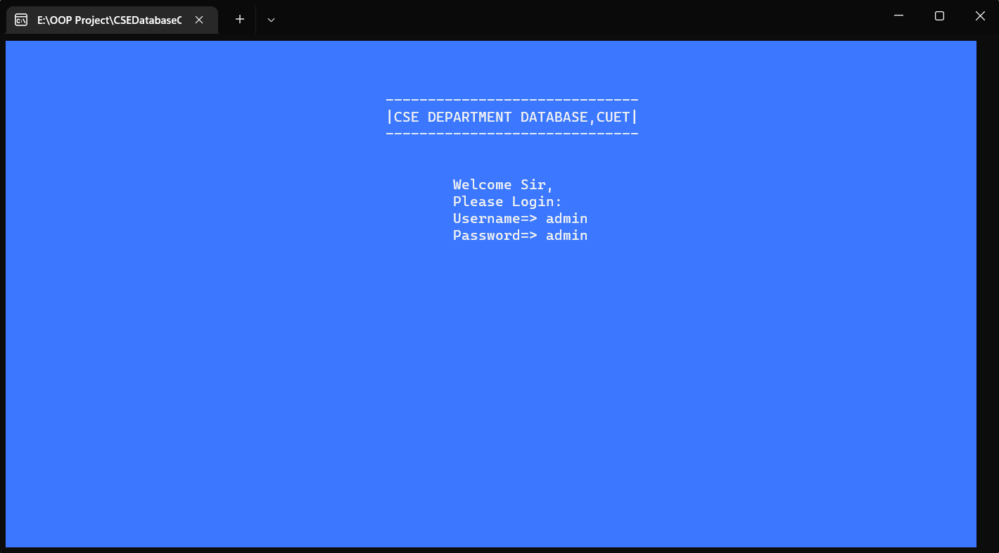
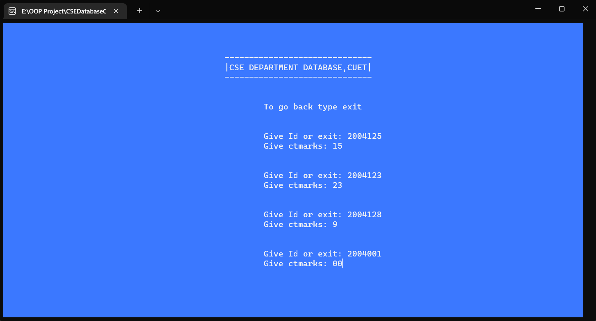
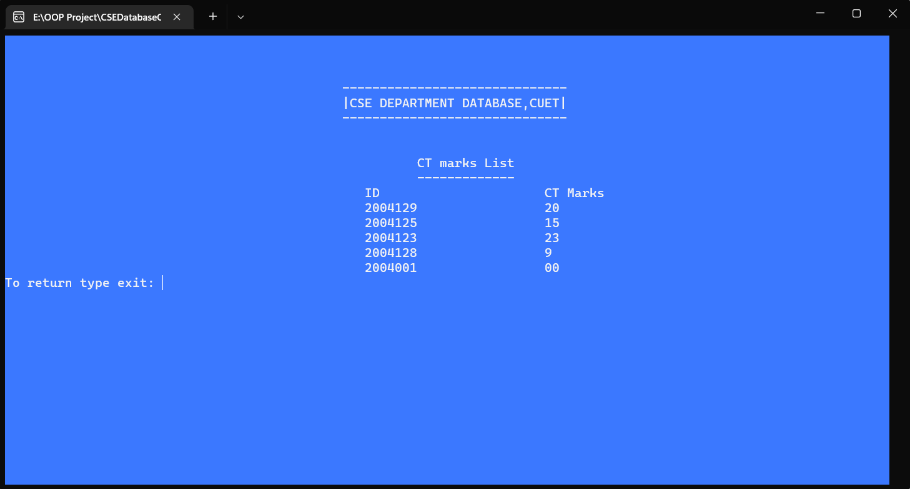
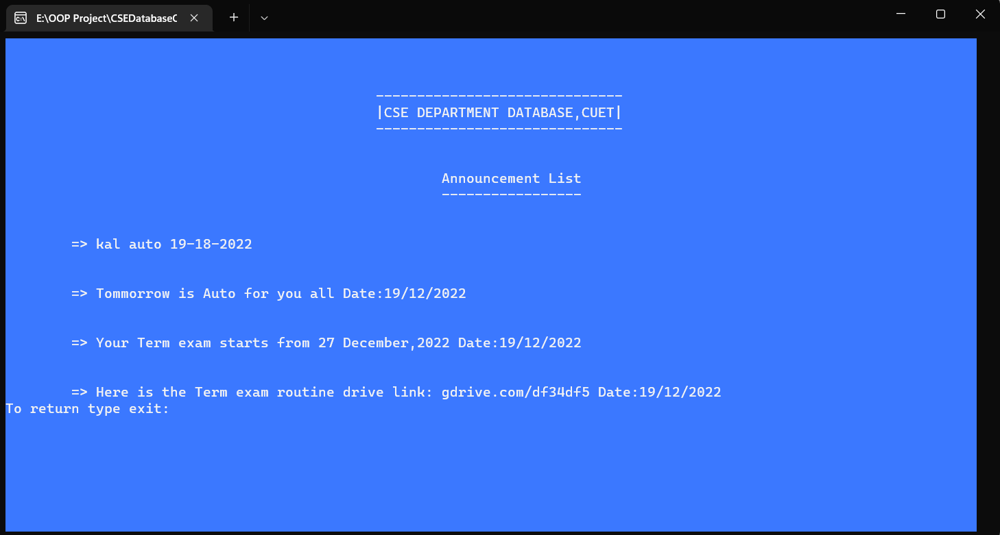
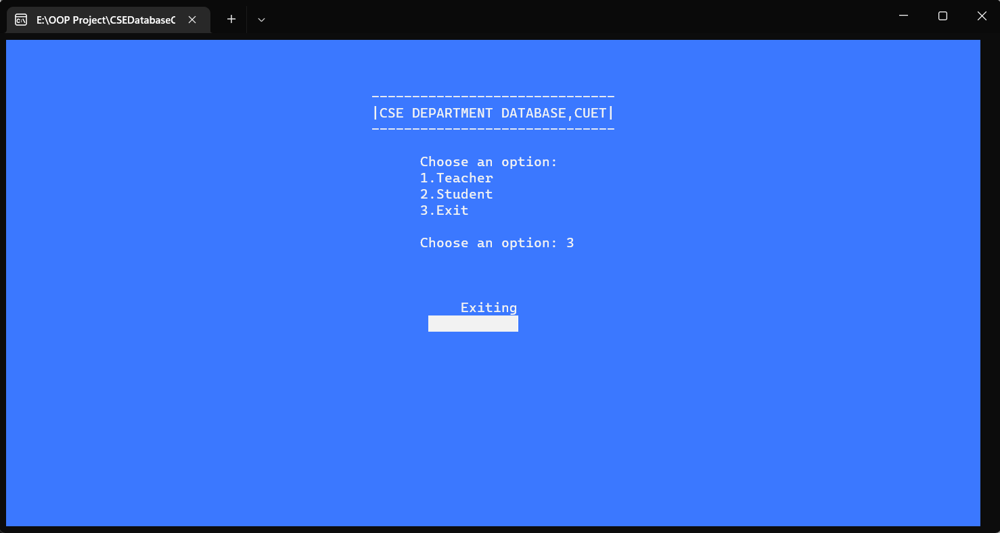

# CSE Department Database System - CUET

A console-based Student-Teacher Database Management System built in C++ for managing academic records, attendance, marks, and announcements for the Computer Science & Engineering Department.

## 🔐 Default Login Credentials

**First-time Teacher Access:**

- **Username:** `admin`
- **Password:** `admin`

> ⚠️ **Important:** Change the default credentials from the Teacher menu after first login for security.

---

## 📋 Project Overview

This is a university database management system designed to streamline academic data management between teachers and students. The system provides:

- **Teacher Interface:** Full CRUD operations for managing student data
- **Student Interface:** Read-only access to view their academic information
- **File-based Storage:** Persistent data storage using text files
- **Dual Role Access:** Separate portals for teachers and students

### Key Features

#### For Teachers:

- ✅ Add/Edit/Delete CT exam marks
- ✅ Add/Edit/Delete Term exam marks
- ✅ Add/Edit/Delete Attendance records
- ✅ Post announcements
- ✅ Share subject resources (Google Drive links)
- ✅ View all student data
- ✅ Change login credentials
- ✅ Erase specific data fields

#### For Students:

- 📊 View CT exam marks
- 📊 View Term marks
- 📊 View Attendance percentage
- 📢 Read announcements
- 📚 Access subject resources

---

## 🛠️ Technical Details

### Built With:

- **Language:** C++ (Standard C++11 or higher)
- **Libraries:**
  - `<bits/stdc++.h>` - STL containers & algorithms
  - `<windows.h>` - Console manipulation & Sleep function
  - `<fstream>` - File I/O operations

### Data Storage:

The system uses text files for persistent storage:

- `ctmarks.txt` - CT exam marks
- `termarks.txt` - Term exam marks
- `attendence.txt` - Attendance records
- `announcement.txt` - Announcements
- `subjectResourse.txt` - Subject resources/links
- `Teacherpass.txt` - Teacher credentials

### System Requirements:

- Windows OS (uses Windows-specific libraries)
- C++ Compiler (GCC, MinGW, MSVC)
- Console terminal

---

## 🚀 How to Run

### Option 1: Run the Executable

Simply double-click the provided `.exe` file

### Option 2: Compile from Source

```bash
g++ SOURCE_CODE.cpp -o CSEDatabase.exe
./CSEDatabase.exe
```

---

## 📁 Project Structure

```
CSEDatabaseCUET/
│
├── SOURCE_CODE.cpp          # Main source code
├── README.md                # Project documentation
├── CSEDatabase.exe          # Compiled executable (if provided)
├── Screenshots/             # Application screenshots
│   ├── shot0.png - shot9.png
│
└── Data Files (Generated at runtime):
    ├── ctmarks.txt
    ├── termarks.txt
    ├── attendence.txt
    ├── announcement.txt
    ├── subjectResourse.txt
    └── Teacherpass.txt
```

---

## 🎯 Usage Instructions

1. **Launch the application**
2. **Select your role:** Teacher or Student
3. **Login** (Teachers only - use default credentials first time)
4. **Navigate the menu** using numeric options
5. **Perform operations** as per your role
6. **Exit** to close the application

---

## 🎓 Academic Use

This project is designed for educational purposes. Feel free to:

- Study the code structure
- Modify for your own institution
- Extend functionality
- Use as reference for C++ file handling concepts

**Note:** The department name "CSE DEPARTMENT DATABASE, CUET" appears throughout the code. You can customize it for your institution by modifying the display strings in the source code.

---

## 📸 Screenshots Preview

The application features a clean console interface with organized menus and data display.

---

## 📸 Screenshots

|       Loading Screen        |          Main Menu          |        Teacher Login        |
| :-------------------------: | :-------------------------: | :-------------------------: |
|  |  |  |

|      Teacher Dashboard      |      Student Dashboard      |       Data Management       |
| :-------------------------: | :-------------------------: | :-------------------------: |
|  |  |  |

|       Viewing Records       |         Adding Data         |        More Features        |
| :-------------------------: | :-------------------------: | :-------------------------: |
|  |  |  |

|       Additional View        |
| :--------------------------: |
|  |

---

## 👨‍💻 Author

**Rifat Hossen**  
ID: 2004129  
Computer Science & Engineering Department  
Chittagong University of Engineering & Technology (CUET)

---

## 📝 License & Contribution

This is an academic project. Feel free to fork, modify, and use for educational purposes.

### Possible Enhancements:

- Add database integration (MySQL/SQLite)
- Implement cross-platform compatibility
- Add password encryption
- Create a GUI version
- Add data export functionality (CSV/PDF)
- Implement user roles and permissions
- Add input validation and error handling

---

## 🤝 Acknowledgments

Created as a university project to demonstrate file handling, OOP concepts, and menu-driven programming in C++.

---

**⭐ If you found this project helpful, please consider giving it a star!**
